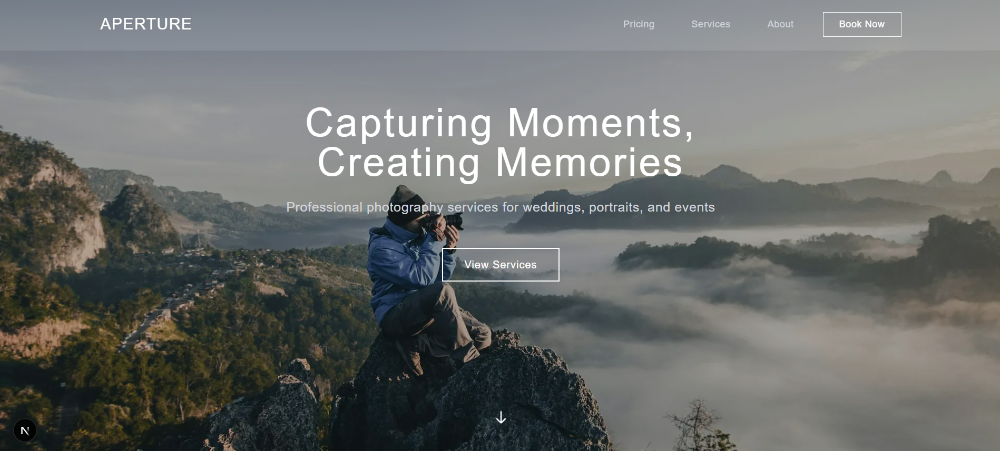

# Aperture – Photography Landing Page 📸

A beautiful, responsive landing page for **Aperture**, a modern photography brand. Built with [Next.js](https://nextjs.org) and optimized for performance and SEO, this site showcases Aperture’s services, gallery, and visual storytelling.


*Hero section with full-width background and call to action*

## 🚀 Features

* Fully responsive, clean UI
* Scroll-based animations
* Optimized image gallery using Next.js `<Image />`
* Custom font via `next/font` (Geist)
* Lightning-fast performance and SEO-friendly

## 🛠 Getting Started

Install dependencies and run the development server:

```bash
npm install
npm run dev
```

Then open [http://localhost:3000](http://localhost:3000) to view the app.

You can start editing the homepage via `app/page.tsx`.

## 🔗 Deployed Link

Live site: [https://aperture-landing.vercel.app](https://aperture-landing.vercel.app)
